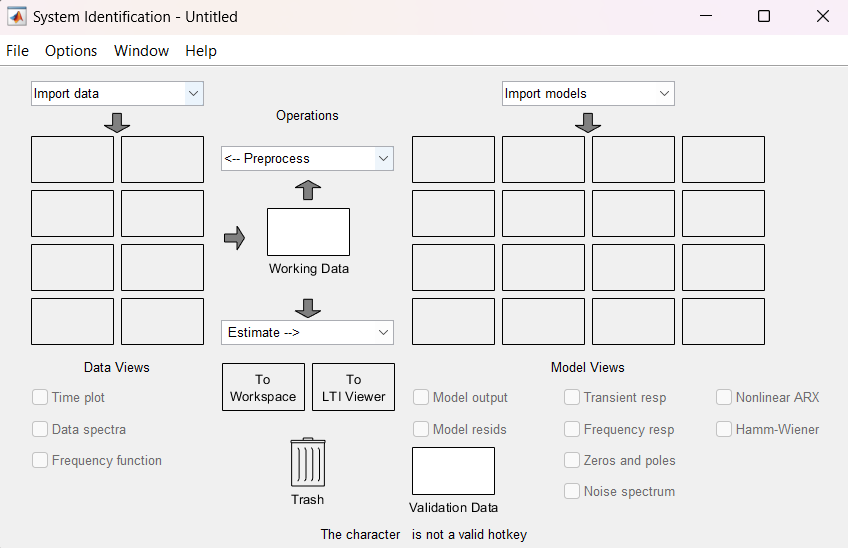
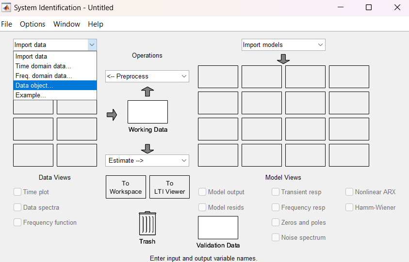
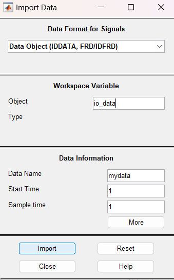
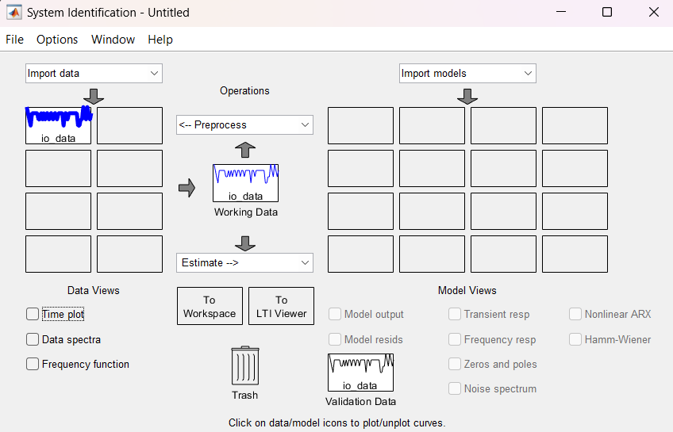
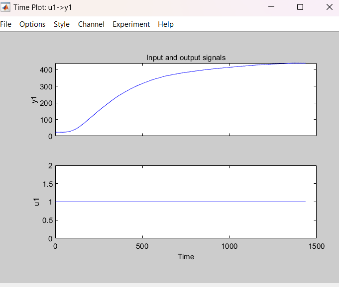
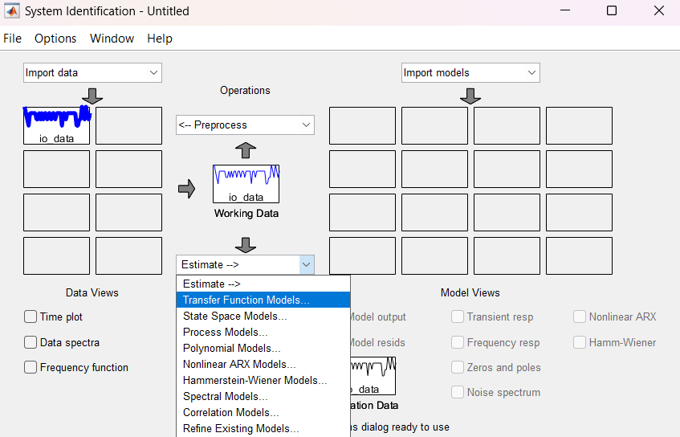
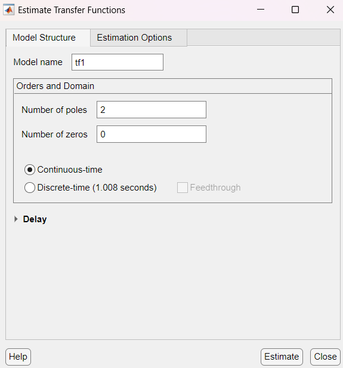
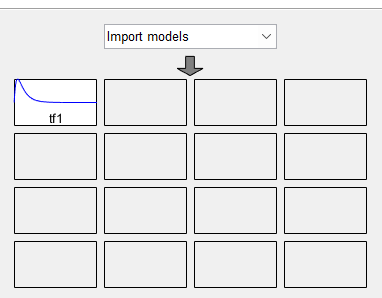
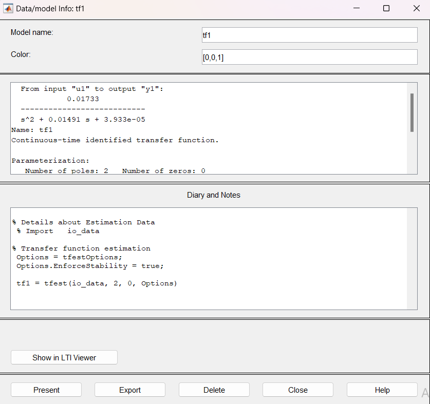
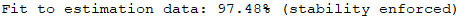

# AFLAREA FUNCȚIEI DE TRANSFER UTILIZÂND SYSTEM IDENTIFICATION

1. Pasul 1

   La acest pas este necesar ca colectarea datelor să fi fost făcută în prealabil. Acestea pot fi stocate sub diferite forme, spre exemplu: în fișiere CSV, JSON, XML.

   
    În acest tutorial, se va folosi o colecție de date, salvate într-un fișier CSV.

    Datele arată în felul următor:

   ```csv
   Timestamp	            Temperature 	RelayOutput
   2024-10-29 20:50:34	    23.5	        230V AC
   2024-10-29 20:50:35	    23.25	        230V AC
   2024-10-29 20:50:36	    23	            230V AC
   2024-10-29 20:50:37	    22.75	        230V AC
   2024-10-29 20:50:38	    23.25	        230V AC
   2024-10-29 20:50:39	    23.25	        230V AC
   2024-10-29 20:50:40	    23.25	        230V AC
   2024-10-29 20:50:41	    23.25	        230V AC
   2024-10-29 20:50:42	    23.25	        230V AC


2. Pasul 2

   În acest pas, se va crea un obiect de tip `iddata`. Acesta are următoarea sintaxă:

   ```matlab
   data = iddata(y, u, Ts)
   ```
   Unde y sunt datele de ieșire; u, datele de intrare, iar Ts este perioada de eșantionare.

   În cazul de față, datele de intrare vor fi datele din coloana "RelayOutput", iar datele de ieșire vor fi datele din coloana "Temperature".

   ```matlab
   % Step 1: Load data from CSV
   data = readtable('data_log_v1.csv');

   % Step 2: Extract relevant columns and process them
   % Convert 'Temperature' to a numeric array
   temperature_data = data.Temperature;

   % Convert 'RelayOutput' to a numeric array (e.g., 1 for "230V AC" and 0 otherwise)
   relay_data = double(strcmp(data.RelayOutput, '230V AC'));

   sampling_time = 1;

   % Step 4: Create the iddata object
   io_data = iddata(temperature_data, relay_data, sampling_time);
   ```
3. Pasul 3

   La pasul 3 se va inițializa systemIdentification prin comanda
   ```matlab
   systemIdentification
   ```
   (acesta trebuie instalat în prealabil din secțiunea Add-Ons)

   Interfața va arăta în felul următor:

   

4. Pasul 4

   Pentru a afla funcția de transfer a sistemului, vom adăuga colecția de date definită anterior, `io_data`, în secțiunea `Import Data`. 

   4.1 Adaugarea datelor, se va selecta  `Data object`:
     
      

   4.2 În noua fereastră se va completa câmpul `Object Type` cu numele obiectului iddata creat anterior, după care se va apăsa butonul `Import`.
     
      


   4.3 În urma pasului anterior, prima interfață va arăta în felul următor:  
     
      


   4.3.1 (Opțional) Pentru a verifica dacă datele sunt corecte, se va realiza un grafic prin bifarea opțiunii `Time plot`.  
     
      

   Se observă că datele sunt corecte.


   4.4 Din meniul `Estimate` se va alege opțiunea `Transfer Function Models`.

      


   4.5 Din fereastra nouă care va apărea, se va alege câți poli și câte zerouri va avea funcția de transfer, după care se va apăsa butonul `Estimate`: 

      


   4.6 Funcția de transfer găsită va apărea în prima fereastră : 

      

   4.7 Cu dublu-click pe noua funcție de transfer, se va deschide o nouă fereastră unde se pot vedea proprietățile funcțiilor de transfer alese:
   
      

   4.8 (Important) Se va verifica ca parametrul Fit to estimation data să fie peste 95%.:

      

   e observă că, în acest caz, valoarea este mai mare decât 95%, deci se poate proceda cu găsirea funcției de transfer a regulatorului.

   În caz că valoarea pentru "Fit to estimation data" este mai mică de 95%, trebuie refăcută colectarea de date.


